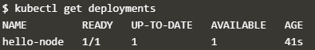

# Hello Minikube
## Sumber : https://kubernetes.io/docs/tutorials/hello-minikube/

Tutorial ini menunjukkan kepada Anda cara menjalankan aplikasi Hello World Node.js sederhana di Kubernet menggunakan Minikube dan Katacoda. Katacoda menyediakan lingkungan Kubernetes dalam peramban gratis.

## Membuat Minikube Cluster
1. Klik Launch Terminal.
   
   
   
   Setelah diklik maka muncul tampilan sebagi berikut :
   
   
2. Buka dasbor Kubernetes di browser:
   
   
3. Klik tab Preview port 30000 dibagian atas.
   
   
4. Pada browser akan muncul tab baru, seperti pada gambar di bawah ini. Ketik 30000, lalu klik Display Port.
   
   

## Membuat Deployment

Kubernetes Pod adalah grup yang terdiri dari satu atau lebih Kontainer, diikat bersama untuk keperluan administrasi dan jaringan. Pod dalam tutorial ini hanya memiliki satu Kontainer. Penyebaran Kubernetes memeriksa kesehatan Pod Anda dan memulai kembali Kontainer Pod jika sudah berakhir. Penempatan adalah cara yang disarankan untuk mengelola pembuatan dan penskalaan Pod.

1. Gunakan perintah kubectl create untuk membuat Deployment yang mengelola Pod. Pod menjalankan Container berdasarkan pada gambar Docker yang disediakan.
   
   
2. Lihat Deployment
   