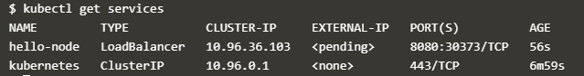

# Hello Minikube
## Sumber : https://kubernetes.io/docs/tutorials/hello-minikube/

Tutorial ini menunjukkan kepada Anda cara menjalankan aplikasi Hello World Node.js sederhana di Kubernet menggunakan Minikube dan Katacoda. Katacoda menyediakan lingkungan Kubernetes dalam peramban gratis.

## Membuat Minikube Cluster
1. Klik Launch Terminal.
   
   
   
   Setelah diklik maka muncul tampilan sebagi berikut :
   
   
2. Buka dasbor Kubernetes di browser:
   
   
3. Klik tab Preview port 30000 dibagian atas.
   
   
4. Pada browser akan muncul tab baru, seperti pada gambar di bawah ini. Ketik 30000, lalu klik Display Port.
   
   

## Membuat Deployment

Kubernetes Pod adalah grup yang terdiri dari satu atau lebih Kontainer, diikat bersama untuk keperluan administrasi dan jaringan. Pod dalam tutorial ini hanya memiliki satu Kontainer. Penyebaran Kubernetes memeriksa kesehatan Pod Anda dan memulai kembali Kontainer Pod jika sudah berakhir. Penempatan adalah cara yang disarankan untuk mengelola pembuatan dan penskalaan Pod.

1. Gunakan perintah kubectl create untuk membuat Deployment yang mengelola Pod. Pod menjalankan Container berdasarkan pada gambar Docker yang disediakan.
   
   
2. Lihat Deployment, hasilnya akan mirip seperti ini :
   
   
   
3. Lihat Pod, hasilnya akan mirip seperti ini :
   
   
4. Lihat Cluster Events
   
   
5. Lihat kubectl
   
   
   
   
## Membuat Service

1. Paparkan Pod ke internet publik menggunakan perintah kubectl expose:
   
   
2. Lihat Layanan yang baru saja Anda buat:
   
   
3. Jalankan perintah berikut:
   
   
4. Hanya lingkungan Katacoda: Klik tanda plus, lalu klik Pilih port untuk dilihat di Host 1.

5. Hanya lingkungan Katacoda: Perhatikan nomor port 5 digit yang ditampilkan berlawanan dengan 8080 dalam output layanan. Nomor port ini dibuat secara acak dan bisa berbeda untuk Anda. Ketikkan nomor Anda di kotak teks nomor port, lalu klik Display Port. Menggunakan contoh dari sebelumnya, Anda akan mengetikkan 30369.
   
   
   Ini membuka jendela browser yang melayani aplikasi Anda dan menampilkan pesan "Hello World".
   

