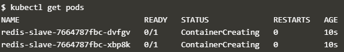
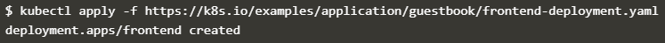
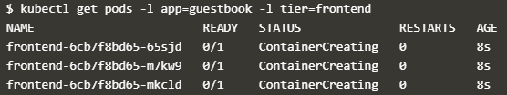
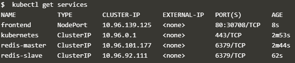
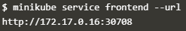
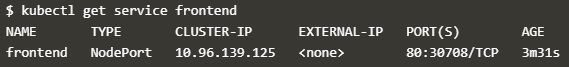
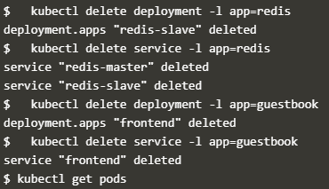

# Deploying PHP Guestbook application dengan Redis

Sumber : https://googleweblight.com/i?u=https://kubernetes.io/docs/tutorials/stateless-application/guestbook/&hl=id-ID
##

Tutorial ini menunjukkan kepada Anda bagaimana membangun dan menggunakan aplikasi web multi-tier yang sederhana menggunakan Kubernetes dan Docker.

## Creating the Redis Master Deployment

1. Buka jendela terminal.
   
2. Terapkan Redis Master Deployment dari file redis-master-deployment.yaml:
   
   
3. Permintaan daftar Pods untuk memverifikasi bahwa Redis Master Pod berjalan. Responsnya harus serupa dengan ini:
   
   
4. Jalankan perintah berikut untuk melihat log dari Redis Master Pod:
   
   
   
Catatan: Ganti POD-NAME dengan nama Pod Anda.
   
   
## Creating the Redis Master Service

Aplikasi buku tamu perlu berkomunikasi dengan master Redis untuk menulis datanya. Anda perlu menerapkan Layanan untuk mem-proxy lalu lintas ke redis master Pod. Layanan menetapkan kebijakan untuk mengakses Pod.

1. Terapkan Redis Master Service dari file redis-master-service.yaml berikut :
   
   
2. Permintaan daftar Layanan untuk memverifikasi bahwa Redis Master Service sedang berjalan:
   
   
Catatan: File manifes ini membuat Layanan bernama redis-master dengan serangkaian label yang cocok dengan label yang telah ditentukan sebelumnya, sehingga Layanan merutekan lalu lintas jaringan ke Redis master Pod.

## Start up the Redis Slaves

Meskipun master Redis adalah pod tunggal, Anda dapat membuatnya sangat tersedia untuk memenuhi permintaan lalu lintas dengan menambahkan replika budak Redis.

## Creating the Redis Slave Deployment

Skala penyebaran didasarkan pada konfigurasi yang ditetapkan dalam file manifes. Dalam kasus ini, objek penyebaran menentukan dua replika.
Jika tidak ada replika yang berjalan, Penyebaran ini akan memulai dua replika pada kluster wadah Anda. Sebaliknya, jika ada lebih dari dua replika sedang berjalan, ia akan turun sampai dua replika berjalan.

1. Terapkan Redis Slave Deployment dari file redis-slave-deployment.yaml :
   
   
2. Permintaan daftar Pods untuk memverifikasi bahwa Redis Slave Pods sedang berjalan. Responsnya harus serupa dengan ini:
   
   
   
   
## Creating the Redis Slave Service

Aplikasi buku tamu perlu berkomunikasi dengan budak Redis untuk membaca data. Untuk membuat budak Redis dapat ditemukan, Anda perlu mengatur Layanan. Layanan menyediakan penyeimbangan muatan transparan ke satu set Pod.

1. Terapkan Redis Slave Service dari file redis-slave-service.yaml berikut:
   
   
2. Permintaan daftar Pods untuk memverifikasi bahwa Redis Slave Pods sedang berjalan. Responsnya harus serupa dengan ini:
   
   
   

## Creating the Guestbook Frontend Deployment

1. Terapkan penyebaran frontend dari file frontend-deployment.yaml:
   
   
2. Permintaan daftar Pods untuk memverifikasi bahwa Redis Slave Pods sedang berjalan. Responsnya harus serupa dengan ini:
   
   

## Creating the Frontend Service

Layanan redis-slave dan redis-master yang Anda terapkan hanya dapat diakses dalam cluster kontainer karena tipe default untuk Layanan adalah ClusterIP.
ClusterIP memberikan alamat IP tunggal untuk set Pods yang ditunjuk Layanan. Alamat IP ini hanya dapat diakses di dalam cluster.
Jika Anda ingin para tamu dapat mengakses buku tamu Anda, Anda harus mengonfigurasi Layanan frontend agar dapat dilihat secara eksternal, sehingga klien dapat meminta Layanan dari luar cluster kontainer. Minikube hanya dapat mengekspos Layanan melalui NodePort.
Catatan: Beberapa penyedia cloud, seperti Google Compute Engine atau Google Kubernetes Engine, mendukung penyeimbang beban eksternal. Jika penyedia cloud Anda mendukung penyeimbang beban dan Anda ingin menggunakannya, cukup hapus atau beri komentar tipe: NodePort, dan tipe tanda komentar: LoadBalancer.

1. Terapkan Layanan frontend dari file frontend-service.yaml:
   
   
2. Permintaan daftar Pods untuk memverifikasi bahwa Redis Slave Pods sedang berjalan. Responsnya harus serupa dengan ini:
   
   
   
## Viewing the Frontend Service via NodePort

Jika Anda menggunakan aplikasi ini ke Minikube atau cluster lokal, Anda perlu menemukan alamat IP untuk melihat Buku Tamu Anda.

1. Jalankan perintah berikut untuk mendapatkan alamat IP untuk Layanan frontend. Responsnya harus serupa dengan ini:
   
   
   
## Viewing the Frontend Service via LoadBalancer

Jika Anda menggunakan manifes frontend-service.yaml dengan tipe: LoadBalancer Anda perlu menemukan alamat IP untuk melihat Buku Tamu Anda.

1. Jalankan perintah berikut untuk mendapatkan alamat IP untuk Layanan frontend. Responsnya harus serupa dengan ini:
   
   
   
## Scale the Web Frontend

Menaikkan atau menurunkan mudah karena server Anda didefinisikan sebagai Layanan yang menggunakan pengendali penyebaran.

1. Jalankan perintah berikut untuk meningkatkan jumlah Pod frontend:
   
   

2. Jalankan perintah berikut untuk mendapatkan alamat IP untuk Layanan frontend. Responsnya harus serupa dengan ini:
   
   
3. Jalankan perintah berikut untuk meningkatkan jumlah Pod frontend:
   
   

4. Jalankan perintah berikut untuk mendapatkan alamat IP untuk Layanan frontend. Responsnya harus serupa dengan ini:
   
   

## Cleaning up
Menghapus Penyebaran dan Layanan juga menghapus Pod yang berjalan. Gunakan label untuk menghapus banyak sumber daya dengan satu perintah.

1. Jalankan perintah berikut untuk mendapatkan alamat IP untuk Layanan frontend. Responsnya harus serupa dengan ini:
   
   
2. Jalankan perintah berikut untuk mendapatkan alamat IP untuk Layanan frontend. Responsnya harus serupa dengan ini:
   